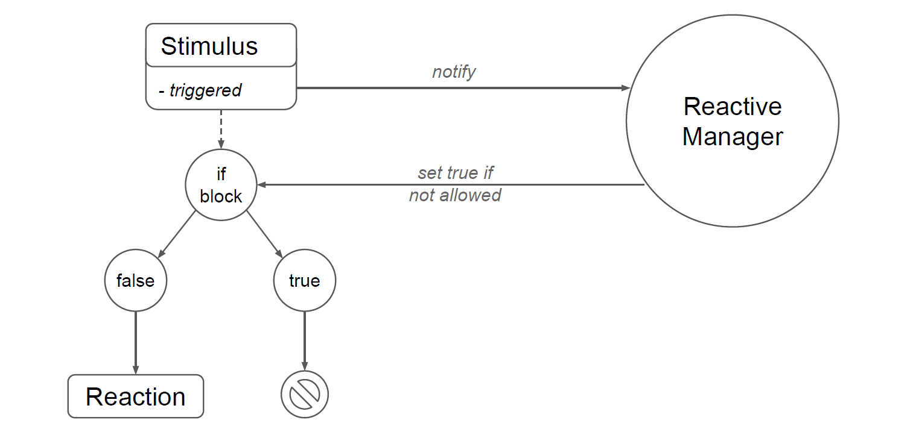

## Abstract
Shadowing is an photo-booth-like installation, where visitors can take pictures of their shadows. People then can download the picture directly onto a smartphone. Since taking a picture often required help from experts, a computer character, KAI, has been added to aid and entertain people throughout the process.

## Project description
The aim of this project has been to extend the capabilities of Shadowing with a computer character, that would help people to take pictures, entertain and furthermore motivate people passing by. Therefore the character "KAI" has been created. KAI is a recursive acronym for "Kai Artificial Intelligence". He is smart, funny, sassy, nerdy, self-confident, would not admit if he was wrong and is quickly bored.

KAI
* Can give a short introduction about the whole Shadowing installation
* Reacts to people passing by and tries to motivate them to make a picture
* Tells users when they are not close enough to the canvas and comments on how quickly they understand
* Can understand a set of voice commands
* Comments on the picture taken
* Tells trivia or nerdy jokes when he is bored

### Making of Shadowing University Fulda 2019


### Photo Galleries
* [Photo Gallery — University Fulda 2019](https://tagdeswissens.fuchsteufels.de/)
* [Photo Gallery — Film University Babelsberg Konrad Wolf 2018](https://shadowing-filmuni18.fuchsteufels.de/)
* [Photo Gallery — Stadt für eine Nacht 2018](https://shadowing-sfen18.fuchsteufels.de/)

## Implementation

As it can be seen in the figure above, the functionality of the computer character is based on stimuli, which each have a specific reaction. When a stimulus gets triggered (because of sensor data or time), a managing instance checks for priorities and currently running reactions. Based on that, a stimulus leads or leads not to an execution of a reaction. 

### Hardware and usage
* Photoresistor (on Arduino Micro): Light barrier to detect if people are close enough to the canvas
* Kinect 360: Track if people pass by
* Microphone: Speech recognition
* Speaker: Speech synthesis
* Monitor: Visual representation of KAI and photo dowload

## Lessons learned
### Speech recognition
In practice it turned out, that interacting with KAI via voice commands would not be used very often. Presumably because first time users don't know the commands and furthermore it is not that great of an advantage compared to pressing a big button close by. In addition Shadowing is beeing performed almost every time in loud environments, which compromise the functionality of the speech recognition system.

### Complexity
Looking back, the project and planned features turned out to be more complex than expected. I probably should have focused more on enhancing fewer features.
