---
# Please replace every occurrence of "xxxx" in this header area with your personal information.
layout: post
title: "The Hive"
author: "Simon Stimberg"
categories: Projects
tags: CC2 WS1819 FinalProject AliveExhibition openFrameworks PhysicalComputing ParticleSimulation Installation Interactive # please add suitable tags — separated by a space — the number of tags is not limited

# The cover image will be seen first. It will also be used to enlist your project amonst others.
cover-image: hiveExhibition04.jpg # choose your desired image file format — must be supported by web browsers — only one
cover-image-title: "installation in exhibition" # a descriptive title for the image
---

## Abstract
The Hive is an interactive light installation that seems to be enlivened by a swarm entity trying to explore its inner world and communicate with the outer one. Consisting of 52 filament light bulbs it visualizes the movement of a particle swarm that is driven by the presence of the viewer and its own shifting emotional states. Abstract expressions of curiosity, fear and anger emerge from the interaction of 100 autonomous particle agents that form a kind of superorganism, raising the question of what is to be considered an individual

## Project description
The Installation is a cluster of light bulbs hanging in a hive-like formation from the ceiling - an electric hive inhabited by a swarm of light.  
Each of the 52 bulbs is individually dimmable via an Arduino resulting in an interface through that the swarms movement through space is visible by mapping its position to the brightness of the light bulbs. The swarm simulation consists of one hundred autonomous agents following simple rules. Nevertheless as a whole it appears as one entity acting with a goal, revealing an emergent behavior.  
Moving around in the boundaries of its world and reacting to the visitor it seems trying to communicate with the outer world. Depending on its mood it shows three different demeanors: shyness, curiosity and anger - or more abstract seen as neutral, positive and negative mood.
For the spatial distribution of the light bulbs an algorithm is used that incorporates the golden angle – similar to formations in nature, which strive for the optimal distribution of seeds or leaves. 



## Implementation
The core of the installation is a OpenFrameworks application running a particle simulation that is moving in a three dimensional, cubic container. Within the same space there is a virtual cluster of 52 light bulbs. By checking how many particles are in close surrounding of each bulb, a brightness value is calculated for every instance, weighted by the distance of particles. One could say the swarm is thereby "mapped" on the bulb cluster.  
The bulbs brightness values are then being send via serial communication to an Arduino, which is connected via USB to the host machine. The Arduino interprets the string of intensities and assigns them to AC dimmers which are connected to a physical cluster of light bulbs.  

For the interactive part the image of a webcam is being analyzed to check whether a visitor is in front of the installation or not. If so the position of the visitor is given to the particle simulation as "attraction point".  

There are 3 different modes ("moods") that determine the particles behavior:
- positive mood / curiosity  
  particles are attracted to the visitor and follow its position/movements  
  if no visitor is around a new attraction point is assigned at a random time span, making the swarm move around  
- neutral mood / shyness  
  particles are repelled by the visitor, fleeing from its position  
  if no visitor is around they are floating around calmly  
- negative mood / anger  
  particles are attracted to the visitor and being accelerated making them moving in a furious manner in a try of attack  
  if no visitor is around the particles are moving around restless and anxious, also the bulbs are flickering randomly  

The overall mood is being changed by a OSC command received via network.

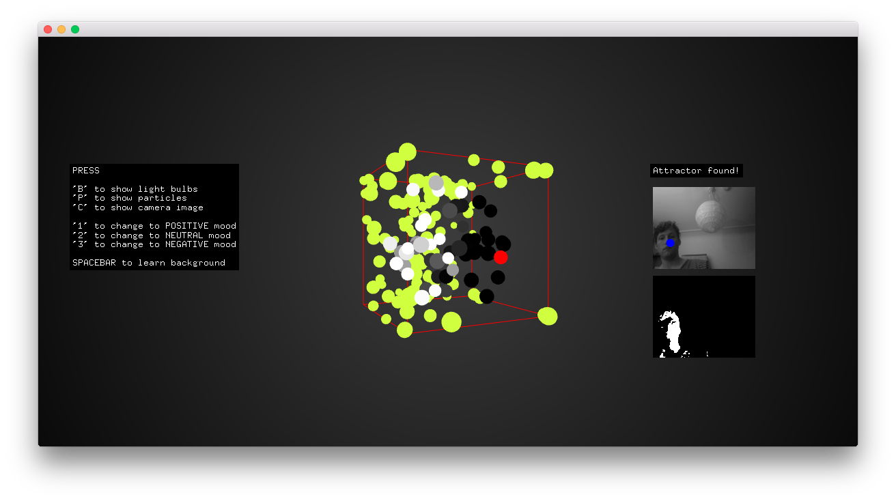

### Class Details
#### Particle Simulation
The algorithm of the particle simulation is based on the "particle example" from the OpenFrameworks examples (inside the "math" subfolder).  
The basic functionality: the velocity of each particle is determined by the force calculated from the distance between particle and attractor. Also a drag is applied to simulate air friction. If there is no attractor in vicinity then the velocity is influenced by noise to simulate a steady floating movement.
#### Image Recognition (objDetector class)
The algorithm for object detection is based loosely on the “opencvExample” from the OF computer vision examples. The app automatically searches for video devices and chooses the first one available. Therefore it can be necessary to set the device ID manually if the desired camera is not chosen right away.
#### Cluster initialization
There are two functions available for the initialization of the bulb cluster. 
- **initPhysicalCluster()**  
  this one has to be used if the physical cluster is connected. It creates a cluster from an array of discrete position values. The X and Z values are derived from the construction while the Y positions have to be measured and manually typed into the array. The unit is millimeter.
- **createRandomBulbCluster()**  
  creates a cluster of random positioned bulbs for testing / demonstration purpose when no physical bulbs are connected. The X and Z values are computed using the golden ratio and the Y distribution follows a algorithm involving noise and a constant scaling factor
#### OSC communication
For the setup in the ALIVE group exhibition the mood change commands are received via OSC over network to sync itself with the other installations. The OSC-address key is “/mood” and the according commands are integer values from 0 through 2 for the different moods.

## Lessons learned
- it is possible to survive working with 230V AC current!
- designing an interaction is a field of work in its own. 
  - "this should normally work" doesn't count - if it's not working, it sucks! (if the user is bored, empathy doesn't help)
  - besides the technical functionality, consider the user's perspective and her/his perception of the experience while interacting

## Images
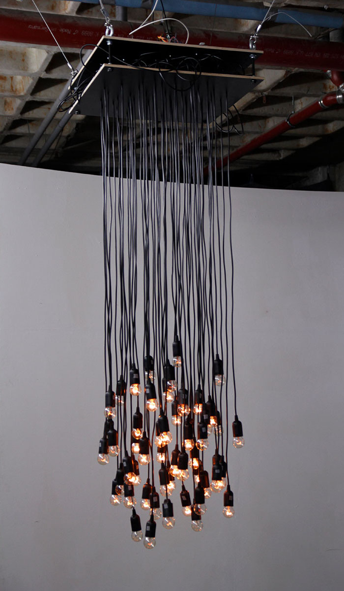  
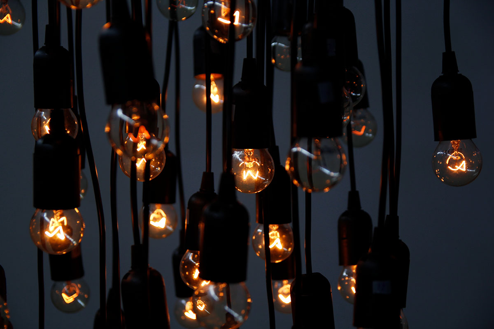 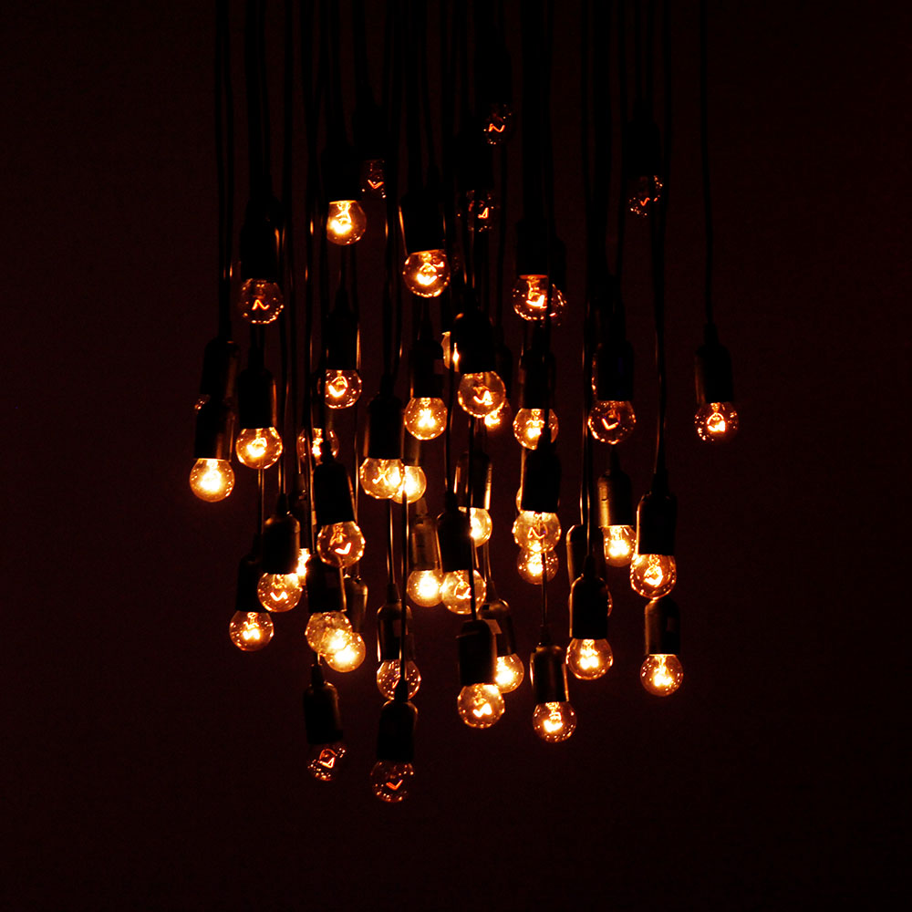
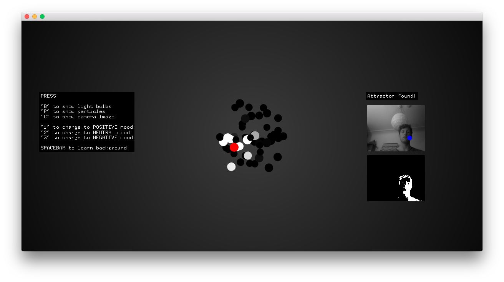 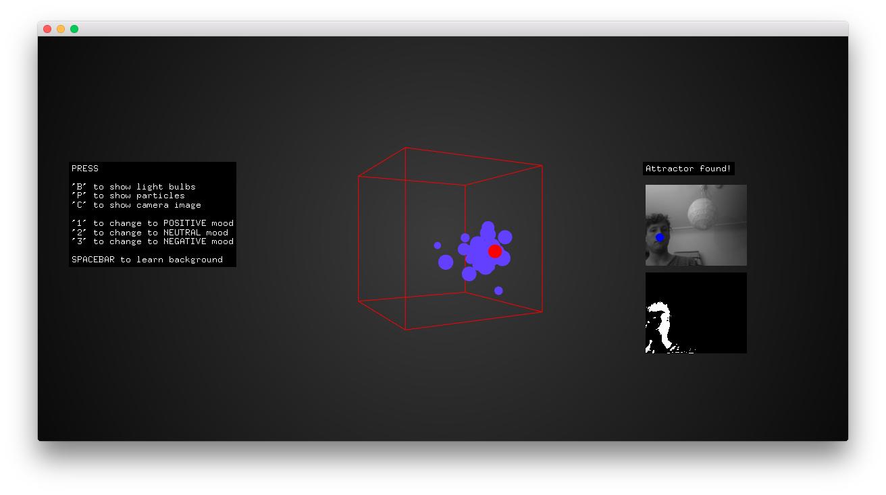 
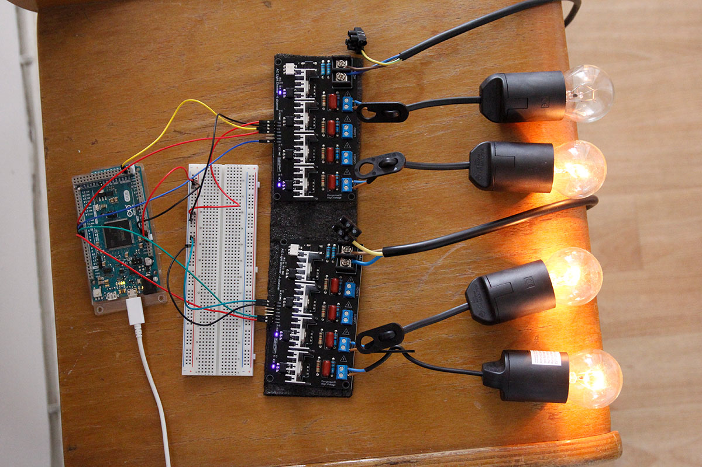 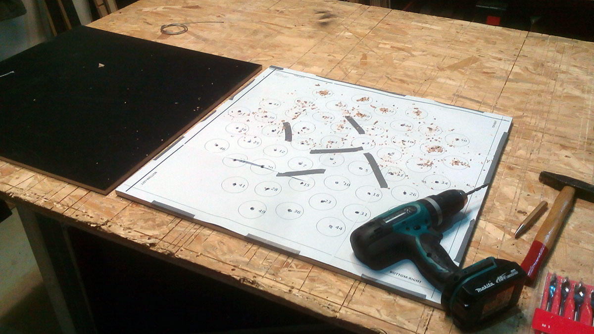
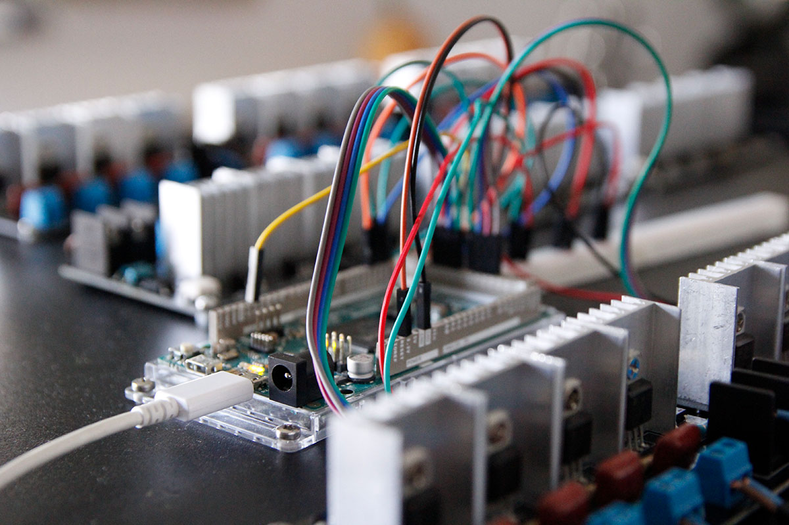 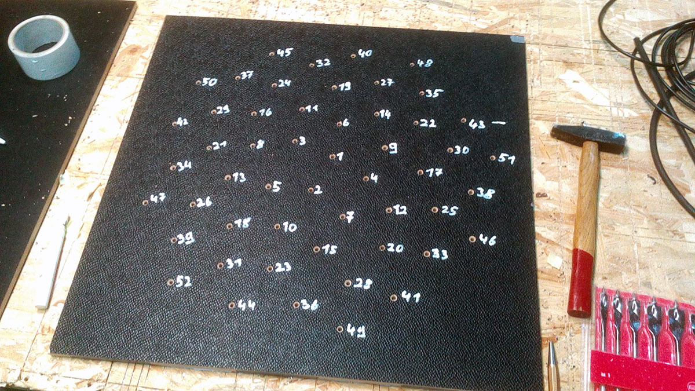
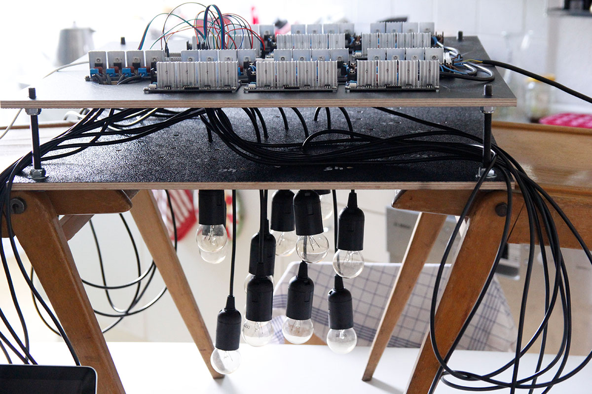 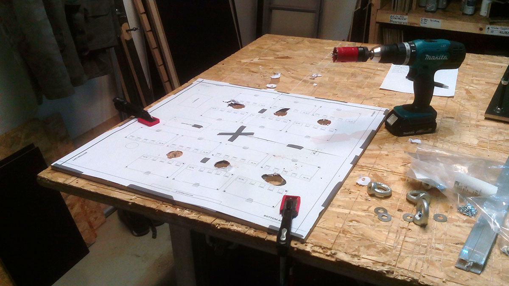
