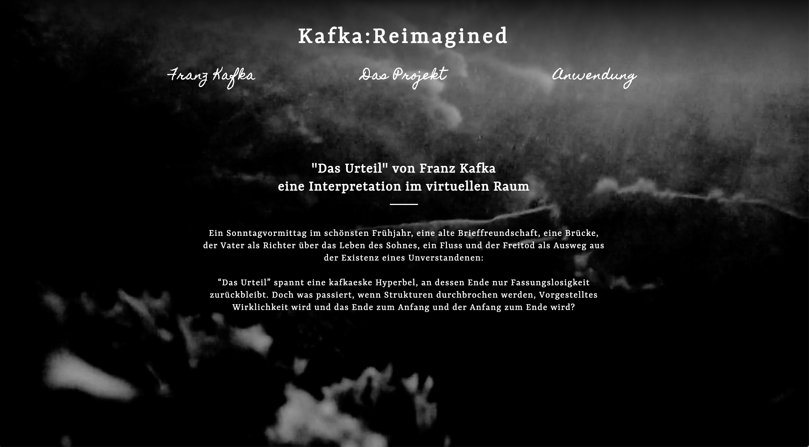
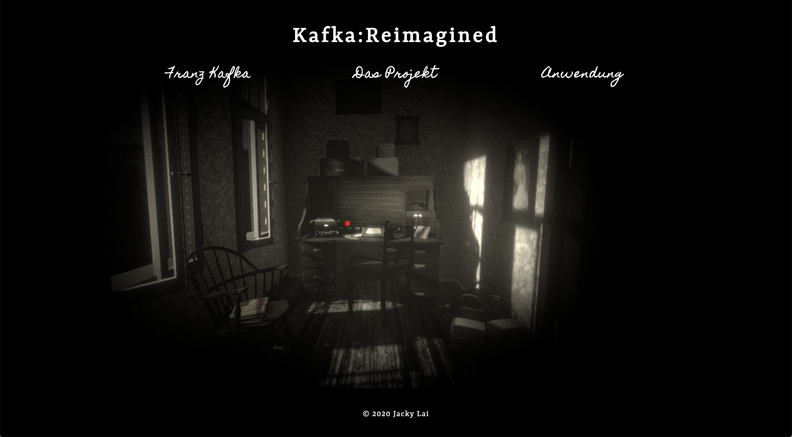

## Abstract
My idea for the final project of Creative Coding I is the implementation of a complementary website for my orientation project "Kafka Reimagined", a virtual reality experience which attempts to visualize the events and dynamics described in Franz Kafka's short story "The Jugdment" from 1912. The final website can be visited under: http://kafka-reimagined.herokuapp.com

## Project description
The aim of this project was to use the skills and technologies introduced in Creative Coding I to create an online representation of my orientation project, which can be easily accessed and shared to a wider audience and should give an introduction and impression of the actual VR experience. My main focus was on the visual appearance, which is supposed to subversively reference the short story's plot through the use of different media formats, such as audio and video and thus, transporting the scenery's atmosphere and delivering a first impression of the project.

### Media
Here you can see the website's landing page with an abstract of the VR experience

...and this is the subpage which contains a WebGL-based version of the VR experience's first scene

## Implementation
In regards of the technical execution, I chose to use JavaScript as the programming language in combination with the web framework Express, which provides a fairly easy solution for creating and structuring websites with several pages. I also used Unity, which is the game engine I used for developing the VR experience and deployed a modified and slightly reduced version of the application's first scene as a WebGL format. For the online deployment of the website, I used the cloud platform Heroku, which has been used as part of previous assignments in the course and also provides a simple way to get your web application online.

## Lessons learned
The main lesson I was able to learn through this project was about bringing together multiple different media formats, web technologies and tools to a quite simple, but still complete web application, which can be accessed and viewed by an audience. Through the work on this project I moreover gained a comprehensive fundament in the context of web devlopment, on which I feel confident to build upon and extend it in order to create more complex web applications or websites which I can use for future projects and work.
