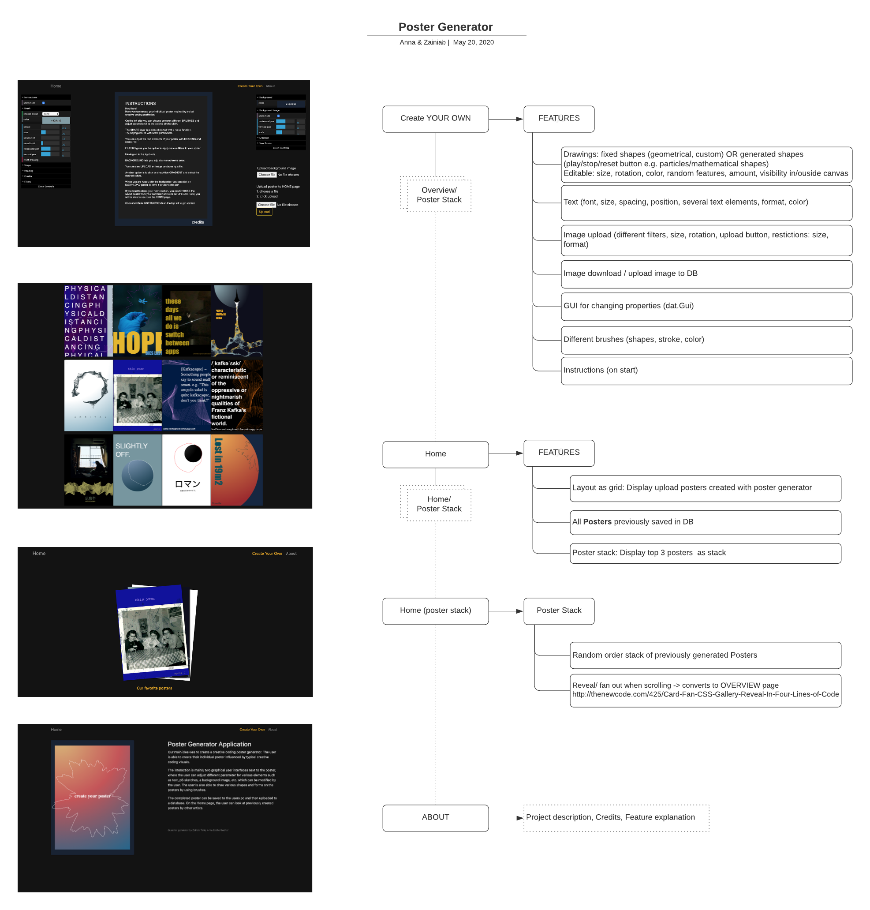

## Abstract
The Poster Generator Application enables you to create your individual Poster influenced by Creative Coding visuals and aesthetics.

[Link to the poster generator](https://postergenerator2020.herokuapp.com/)

## Project description
Our main idea was to create a creative coding poster generator. The user is able to create their individual poster influenced by typical creative coding visuals.

The interaction is mainly two graphical user interfaces next to the poster, where the user can adjust different parameter for various elements such as text, p5 sketches, a background image, etc. which can be modified by the user. The user is also able to draw various shapes and forms on the posters by using brushes.

The completed poster can be saved to the users pc and then uploaded to a database. On the Home page, the user can look at previously created posters by other artists.

## Implementation

## Lessons learned

- How to use and access a cloud storage for image files
- Better understanding of P5.js
- How to integrate a graphical user interface
