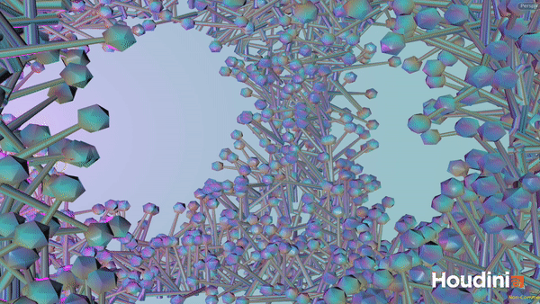

---
# Please replace every occurrence of "xxxx" in this header area with your personal information.
layout: post
title: "Houdini Using Noise"
author: "Lena Gieseke"
categories: Projects
tags: PGS Houdini SS20 noise

# The cover image will be seen first. It will also be used to enlist your project amonst others.
cover-image: pgs_ss20_tutorial_04_tariq01.png # choose your desired image file format — must be supported by web browsers — only one
cover-image-title: Using noise in Houdini # a descriptive title for the image
---

## Exercise

Using noise in Houdini.  

  
  
by Anna  

  
by Zainab  

  
by Jack  

  
by Ellina  

