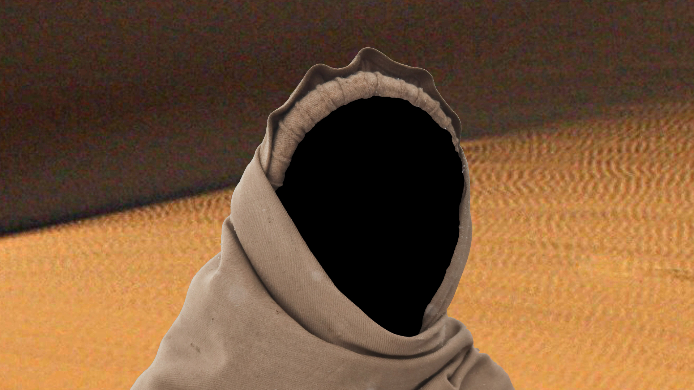

---
# Please replace every occurrence of "xxxx" in this header area with your personal information.
layout: post
title: "Path"
author: "Markus Traber"
categories: Projects
tags: CC2 openFrameworks FragmentShader SS19

# Please add suitable tags, separated by a space. If you decide to add new 
# tags, consider the naming conventions, mentioned in the How-To in section 
# "1.1.1 Tags".
# You can choose from already existing tags, listed in the following comments:

# AbletonLive AI AliveExhibition Audio C++ CC1 CC2 ChristmasCard Dynamics 
# Extrusions FragmentShader GenerativeArt Houdini Installation Instrument 
# Interactive Maths Midi Modeling MovieAnalysis Noise openFrameworks 
# OrientationProject p5js Particles ParticleSimulation PGS PhotoBooth 
# PhysicalComputing Rigging SineWave SineWaveAnimation SS19 SS20 Storytelling 
# TouchDesigner Ultrasonic Unity WS1819 WS1920

# The cover image will be seen first. It will also be used to enlist your project amonst others.
cover-image: screenshot.png # choose your desired image file format — must be supported by web browsers — only one
cover-image-title: Path - Project start screen # a descriptive title for the image
---

## Abstract

Path is an interactive story about a protagonist being lost in the desert and deals with the topic of free will. The project is being laid out to appear as a video game, when in fact, it is not. There is no way to "win" the "game", but the project might suggest otherwise.

## Project description

Do we as humans really have free will or is our decision making a simple result of all the influences or variables, that surround us? The project Path tries to make the user believe, that he/she/* can have an impact on the outcome of the story. While the experience with the project might differ for different users, the outcome is always the same: The users are being confronted with themselves and trapped in an infinite story loop.

## Implementation

### Overall Architecture

For the overall architecture the openFrameworks addon "ofxAnimationPrimitives" has been used. Therefore the project is structured into "Scenes" and "Compositions". Each scene consists at least of one or multiple compositions. In this case, each composition has been used to process a picture in order to achieve a "Canny Edge"-Look, which will be described in the following section. Furthermore are the compositions and scenes used, to fade the pictures in and out.

Most of the pictures resources have been downloaded, while some are my own photographs. Almost all pictures have been graphically altered by myself for the project in advance.

### Image processing - Canny Edge

The "Canny Edge" look of the graphical output has been achieved with multiple shaders, I integrated. Since the I would need to process images multiple times during runtime, I created a static function to apply all these shaders to an image. The following two example pictures show how input and output image look like.

__Image before conversion:__

  
[Image source: pixabay.com](https://pixabay.com/de/photos/w%C3%BCste-sand-sandd%C3%BCnen-sahara-gobi-1840453/)

__Image after conversion:__

Furthermore I planned on implementing another shader, which I found on Shadertoy. The plan was to use it in order to bring a bit movement to the now static output, which was intended to make the project feel sort of animated. Therefore I adapted the shader to my needs, unfortunately I could not get it to work with openFrameworks. I suspect it has to do with the used OpenGL version.

The following two images show what I wanted to achieve with the shader. The first one is a standard resource image from Shadertoy. The second one shows how it would look like with the shader applied. The original shader on Shadertoy can be [found here](https://www.shadertoy.com/view/Xsfyzr).

__Static source image:__

  
[Image source: Shadertoy standard input channel texture](https://www.shadertoy.com)

__Image sequence with shader applied:__

### State management

I integrated a very simple state management class, in order to store decisions or app states centrally. Because of its static nature, it can be accessed from everywhere within the app.

### Head tracking

With the addon "ofxOpenCV" and a Haar Cascade file (from the openFrameworks examples) I can easily detect human faces, which are in front of a webcam. I also  laid out the functions of this class to be static. The class includes simple functions in order to obtain a rough head position like "left", "right" or "top left", etc.. This is being used at one scene of the story in order to determine, which route (left/right) to take. There is no hint about this in the graphical output, as the user is not intended to know.

I also implemented a function in order to obtain a cropped image of the currently tracked person, which is being used to integrate it into the scenery (see next section).

### Head scenery integration

At one moment in the story, the user is being confronted with its own identity. For that I am using the head tracking in order to take a picture of the face of the user. In my head tracking class, the image is being cropped to the rough head size, see  the red rectangle in the following screenshot. Afterwards a mask in form of an ellipsis (red ellipsis in the screenshot) will be applied to the image to just maintain the picture information of the face.

The masked and cropped picture of the face is now being scaled in order to fit into the hood in the scenery. It is then being drawn to the destined position on the canvas.

The following mask has been created beforehand with a image manipulation software. It is being applied to the scenery image (see second following screenshot) to not draw the inner of the hood.

  
[Image source foreground: pixabay.com](https://pixabay.com/de/photos/afghani-menschen-mann-k%C3%A4lte-winter-60700/) | [Image source background: pixabay.com](https://pixabay.com/de/photos/w%C3%BCste-sand-keine-person-reisen-3106739/)

The scenery with the mask applied will now be drawn on top of the canvas and the face picture. A result, with me as the user, can be seen in the following screenshot.

## Lessons learned

* Dedicate more time to shader programming and the usage in openFrameworks

## Possible future work
 * Successfully integrate distortation shader, tweak visual output
 * Implement more interaction possibilities
 * Integrate more sceneries
