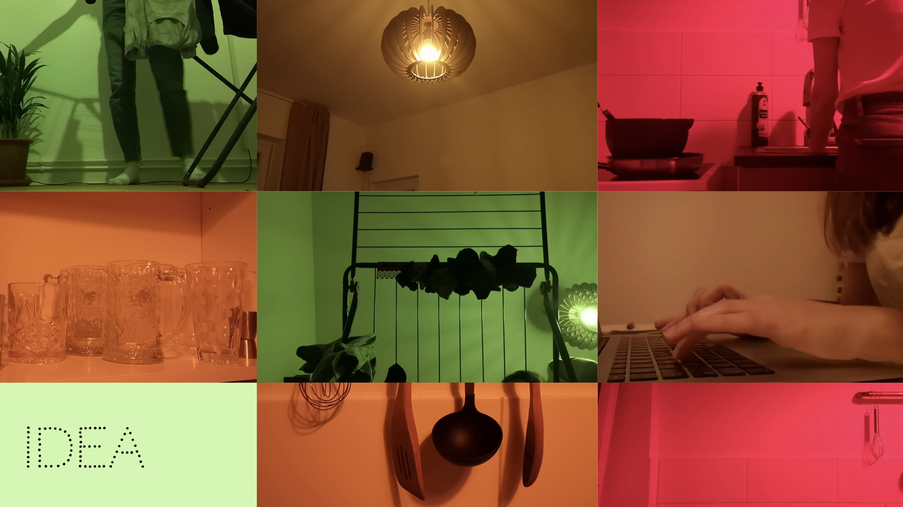
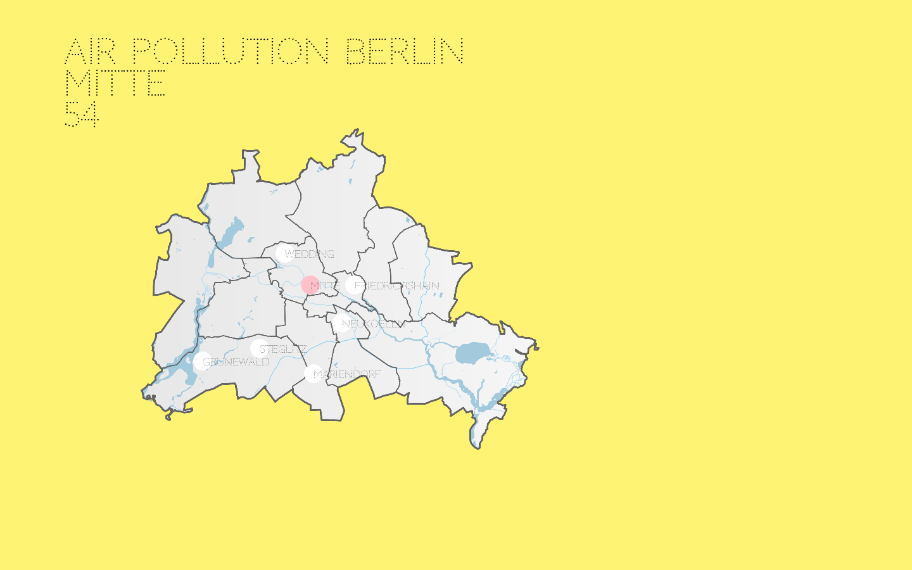
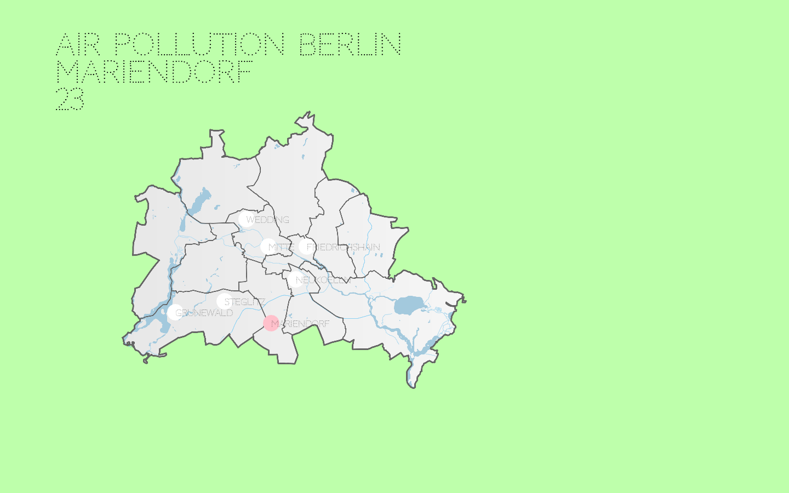
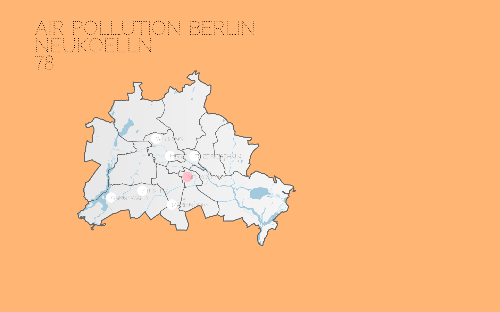
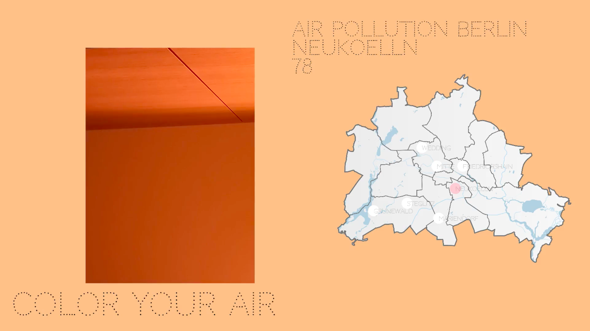
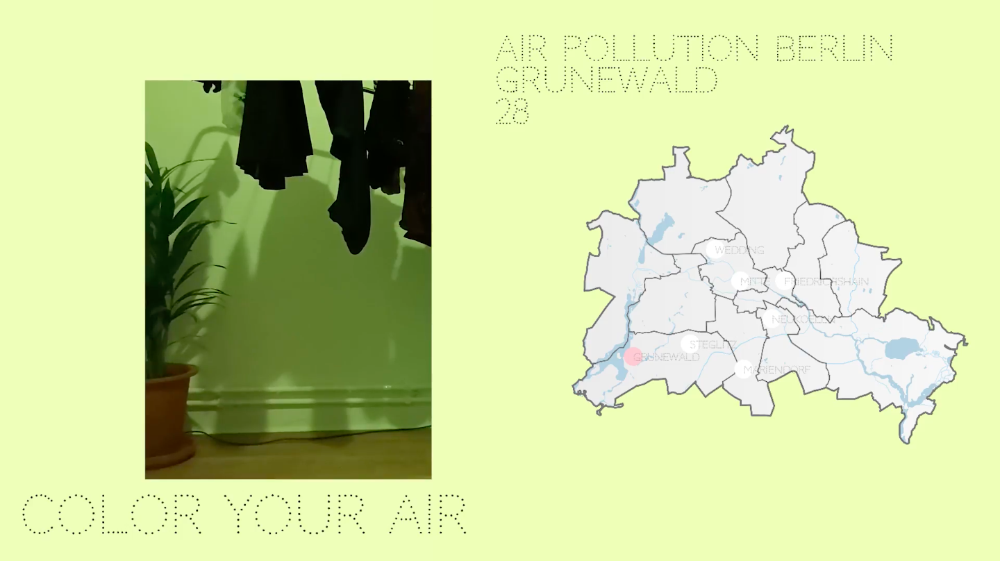
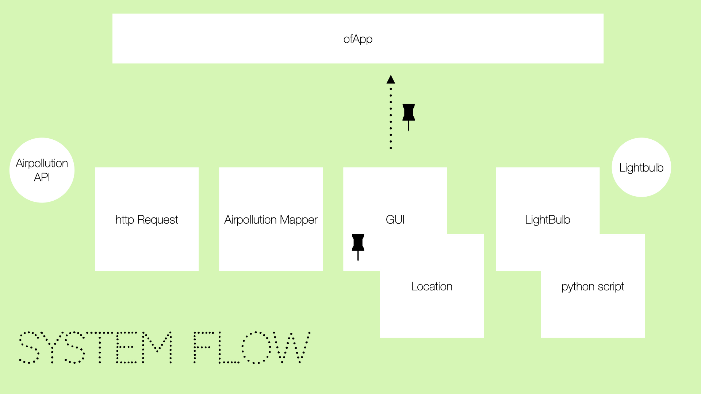
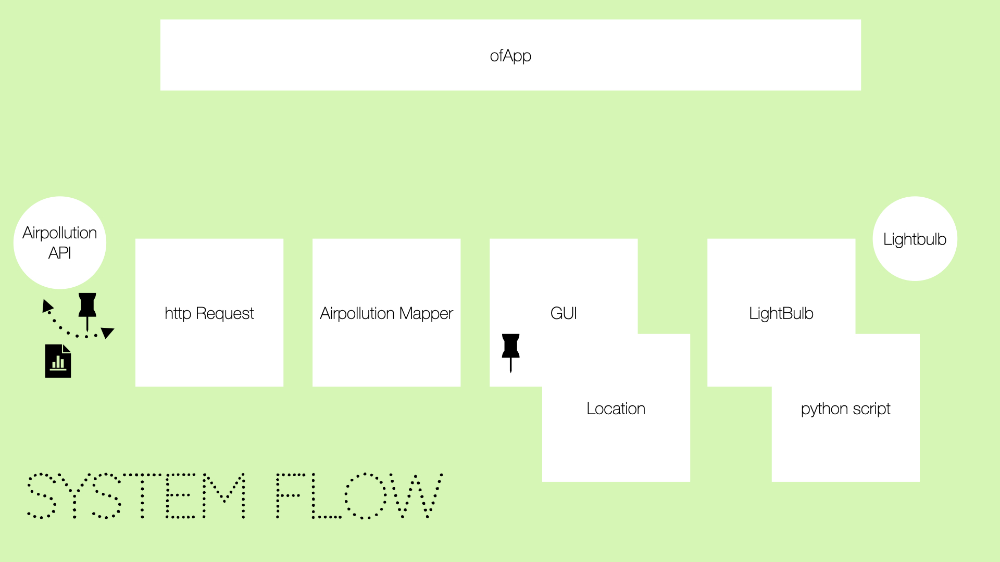
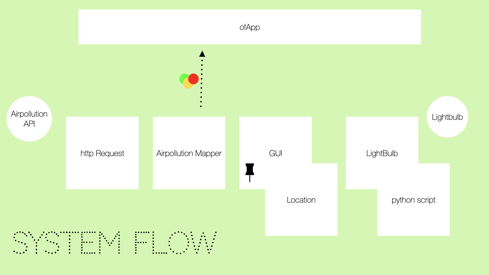
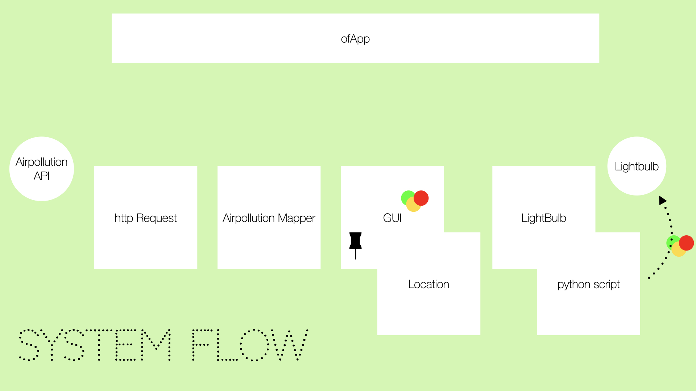

---
# Please replace every occurrence of "xxxx" in this header area with your personal information.
layout: post
title: "Air Pollution in Berlin: Make the invisible visible"
author: "Johanna Hartmann"
categories: Projects
tags: CC2 OpenFrameworks SmartHome 

# Please add suitable tags, separated by a space. If you decide to add new 
# tags, consider the naming conventions, mentioned in the How-To in section 
# "1.1.1 Tags".
# You can choose from already existing tags, listed in the following comments:

# AbletonLive AI AliveExhibition Audio C++ CC1 CC2 ChristmasCard Dynamics 
# Extrusions FragmentShader GenerativeArt Houdini Installation Instrument 
# Interactive Maths Midi Modeling MovieAnalysis Noise openFrameworks 
# OrientationProject p5js Particles ParticleSimulation PGS PhotoBooth 
# PhysicalComputing Rigging SineWave SineWaveAnimation SS19 SS20 Storytelling 
# TouchDesigner Ultrasonic Unity WS1819 WS1920

# The cover image will be seen first. It will also be used to enlist your project amonst others.
cover-image: aqi4.png # choose your desired image file format — must be supported by web browsers — only one
cover-image-title: xxxx # Color your smart light according to the air quality in Berlin - how polluted is the air?
---

## Abstract

Do you actually know the quality of the air you breath in? Air Pollution is invisible. And it is always around us in Berlin. This project makes the invisible visible and colors the light around you according to the quality of the air. How does it work? With a smart light bulb, that you connect to the app. 

## Project description

Although air pollution is a ubiquitous problem, it remains invisible to us. This app makes the invisible visible. It does this by colouring the air around us - in a way that reflects the air quality. Here, I focus on the air pollution index (AQI) in Berlin. The app retrieves the current value of each district and calculates a colour to match the quality. That means that the lamp lights up green when the air quality is good and red as soon as it is unhealthy for sensitive groups. The classification here comes from a WHO recommendation. The app works with the IKEA Tradfri gateway, to which an RGB light bulb must then be linked. With the help of a library, my app controls the light, so that the colour changes. If you don't have an RGB bulb, it is not a problem. If it is possible, the app dims the light bulb if the air quality is poor and. In any case, the background colour of the app changes accordingly to give immediate feedback.  So it is possible to use it without an RGB bulb.

The app aims to create awareness for air quality and air pollution in Berlin by making the invisible problem visible.

Here is a link to the [visual documentation](https://www.youtube.com/watch?v=EYrlpDQTe8c)



### Interface

### Interface and Smart Light

## Implementation

I implemented it in OpenFrameworks and Python.

The first step is to use the gui to specify the location from which the airpollution should be determined. 

From this location the app determines the airpollution via an API.

This value is then converted to a color for the background and a color for the lamp. 

The lamp is controlled with the Pytradfri library. This library allows to control IKEA gateways and their associated devices with Python. Thus the color of the lamp is passed as argument into a Python script.

## Lessons learned

- I learned a lot about different smart home systems. It was complicated to find a suitable library and a suitable light bulb. 
- I learned about communication with different devices, because my program is mainly an interface between Air Pollution and the light bulb
- a challenge was the location, because I wanted the user to determine the location initially, which lead to a lot of hurdles. I think the solution with concentrating on Berlin is nice, but I would like to try to stretch the possible locations in the future
- some things about Air Pollution
- I learned how to call external Python Scripts with C++