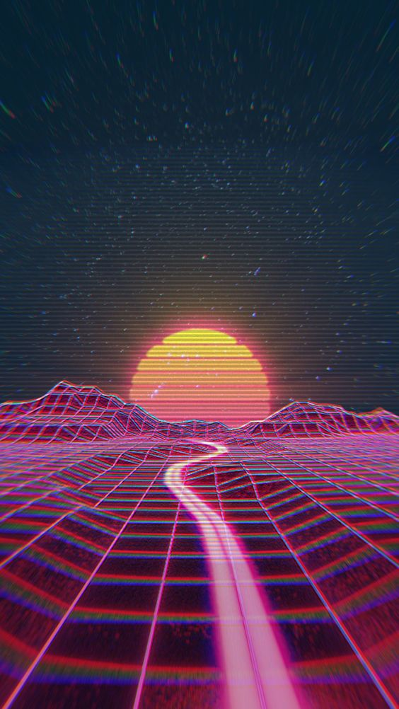
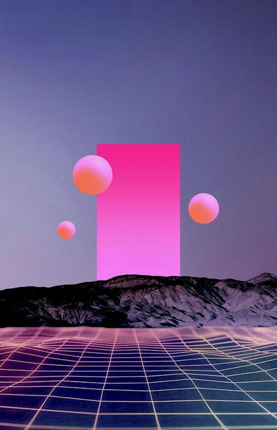
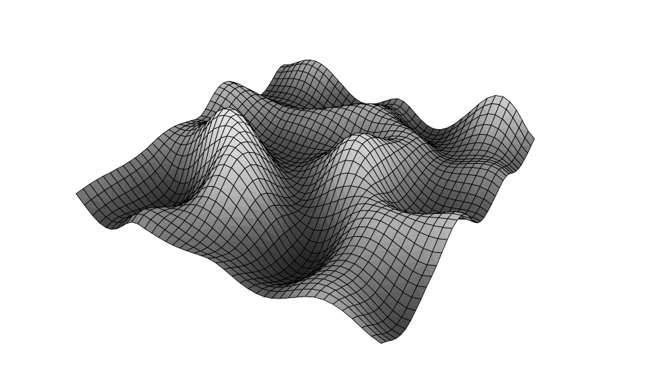
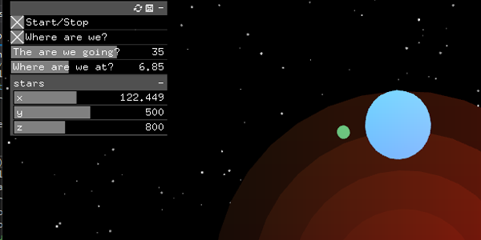

---
# Please replace every occurrence of "xxxx" in this header area with your personal information.
layout: post
title: "Roadtrip"
author: "India Aparicio"
categories: Projects
tags: CC2 SS21 openFrameworks C++ Shader

# Please add suitable tags, separated by a space. If you decide to add new 
# tags, consider the naming conventions, mentioned in the How-To in section 
# "1.1.1 Tags".
# You can choose from already existing tags, listed in the following comments:

# AbletonLive AI AliveExhibition Audio C++ CC1 CC2 ChristmasCard Dynamics 
# Extrusions FragmentShader GenerativeArt Houdini Installation Instrument 
# Interactive Maths Midi Modeling MovieAnalysis Noise openFrameworks 
# OrientationProject p5js Particles ParticleSimulation PGS PhotoBooth 
# PhysicalComputing Rigging SineWave SineWaveAnimation SS19 SS20 Storytelling 
# TouchDesigner Ultrasonic Unity WS1819 WS1920

# The cover image will be seen first. It will also be used to enlist your project amonst others.
cover-image: ./finished.png # choose your desired image file format — must be supported by web browsers — only one
cover-image-title: Roatrip - a audiovisualizer # a descriptive title for the image
---

## Abstract

The project should serve to go through a complete workflow of a project in openframeworks and thus learn more about the framework and C++. For this I focused on the topics meshes and shaders on the one hand and sound on the other hand. The goal of the project was to create an interactive audiovisual graphic, which should remind of the atmosphere of a road trip. 

## Project description

Everyone knows the feeling: sitting in the car and driving past a beautiful landscape while listening to your favorite song. It has a very unique mood that is very relaxing. There is no stress and you just enjoy the sound and the environment. I wanted to recreate that mood with the project. It's an audio-visual interactive application that represents a landscape that you drive along and never seems to end. Planets circle over the landscape and stars can be seen in the distant horizon. You can drag and drop your desired song and just enjoy the view. Due to the apparent movement towards the horizon, the application attracts glances. The color scheme contains a lot of dark, red and blue tones, so it is rather reminiscent of the night. The following images have served as inspiration. The application can be used as a relaxing application for visualizing music.

## Implementation

The project was developed with openframeworks and c++ using the IDE visual studio. I proceeded as follows: First I created a mesh, which I programmed into a kind of terrain using Perlin noise. Then I added more shapes and meshes to add more details like the planets or stars. Then I added a GUI so that the user can influence the style of the application. To make the application move according to the music, I also did an FFT analysis and linked the values to some parameters. Finally, I added shader files to make the meshes appear in color through shaders.

### Terrain mesh 

The first task was to create a mesh with noise, as it looks in the following figure:

First I created a mesh with the mode `OF_PRIMITIVE_TRIANGLES`. In `set up()` I then set a width and length of the mesh and then created a vertex per the width and height values using two loops. After that I added indexes again by two loops and thus connected the vertices to triangles. After that the mesh looked like this:

In `update()` I then added the perlin noise. For this I looped again through the values of width and height. In the loop I always stored the last position of the vertex in a Vector3. On the z-value I then applied `ofNoise()` and assigned the vertex a color based on the z-position. I also tied the y-value of the mesh to time so that the mesh appears to be moving.
In `draw()` the mesh then only had to be mapped. Then the mesh looked like this: 

To add another road to the mesh, I added no Perlin noise to all values of the mesh that were in a certain range and gave them a different color. Also, I wanted the mountains to get higher the farther they were from the road. So I linked the height of the mountains to the numbers of the x-values (the road was at 0 and therefore to the left and right the x-values became higher). After that the mesh looked like this:

### Other meshes and shapes

Now followed the addition of other shapes: a sun or planet around which other planets orbit, a moon, stars and two-dimensional shapes that should appear on the horizon. For this I used different `ofDraw()` functions and by translating the matrix and rotation functions I mapped the different objects and let them rotate around different axes and centers. I created the stars by using loops at random positions of certain boundaries and made them flicker by random values of the alpha channel. After implementing these shapes, the composition looked like this:

### Sound implementation
#### FFT

To make the project respond to sound, I performed an FFT analysis. The frequencies were divided into 512 "bands" and the volume in the frequency range was stored in `fft[bands]`. This allowed me to tie different parameters to specific frequency volumes. For example, I tied each circle on the horizon to a different frequency range (the smaller the circle, the lower the frequency). Then I tied the mesh to the frequencies as well: The further away the mesh is from the path, the lower the frequencies.

#### Sound Drag and Drop

I also added the feature that the user can choose their own song by simply dragging and dropping a song into the project. To do this, I assigned a SoundPlayer to the dragged object in `ofApp::dragEvent()` and let the track play there directly in the loop. 

### GUI

For more interactivity I also added a GUI so that the user can influence certain parameters himself. In `setup()` I created all GUI elements as slider (float or integer) or toggle (boolean) and displayed the gui in `draw()`. This way I could then easily use the user input as a variable in the code. This is how the GUI looked for the first time:

### Shader

Finally, the last task was to give the meshes shader. This task was also the most difficult for me. After a relatively long phase with a lot of trail and error, I was able to create the shader files and link them to the meshes. I was also able to add `uniform` variables to communicate between the questionment shader files and the `ofApp.cpp` file. For example, I passed time and the fft values to the shader as uniform variables.

I used a total of 5 different shaders: one for the background, one for the two-dimensional shapes, one for the planets, one for the sun, and one for the terrain. After a long time of work and many tutorials, I unfortunately didn't manage to use the vertex shader specifically so that the shader changes based on the movements of the mesh. Therefore I worked exclusively with fragment shaders and programmed shaders that remind me of mixing watercolors by using sine, cosine and time-mapping. 
The finished application looks like this:

Look at [demo](https://www.youtube.com/watch?v=te5B8xOQGnE)

## Lessons learned

- I learned how a workflow can work with openFrameworks. 
- Improvement in shader programming and the use of uniform.
- More knowledge about noise and how to use it.
- How FFT works in openframeworks
- More about the syntax of c++
- I was able to use a few functions I learned this semester in PGS.

## Possible future work

- Use vertex shader.
- Improvement of shaders
- Appearance of certain objects in the environment, which you "drive past".
- Release, so that it becomes publicly usable as a music visualizer and thus also reacts to music that is played somewhere on the computer.
