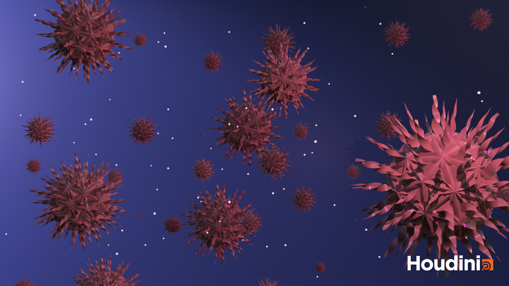
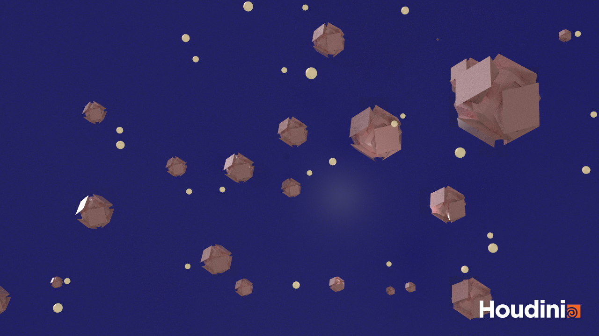
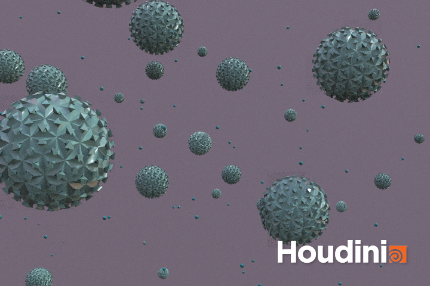
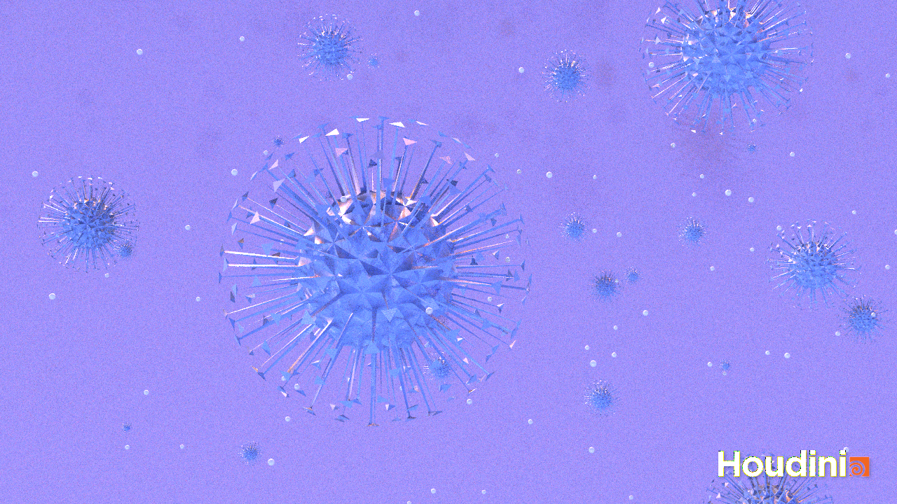

---
# Please replace every occurrence of "xxxx" in this header area with your personal information.
layout: post
title: "Houdini Extrusions"
author: "Lena Gieseke"
categories: Projects
tags: pgs houdini SS20 extrusions

# The cover image will be seen first. It will also be used to enlist your project amonst others.
cover-image: pgs_ss20_tutorial_01_nurmukhametova.png # choose your desired image file format — must be supported by web browsers — only one
cover-image-title: Extrusions in Houdini # a descriptive title for the image
---

## Exercise

An introduction to Houdini. Example had to include extrusions, object scattering, a camera, an environment light and at least one material.

  
by Anna

  
by Rita

  
by Zainab

  
by Ellina

  
by Jack

